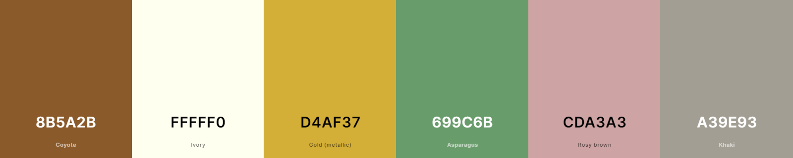

# Aurum Reborn

[LIVE SITE](https://aurum-reborn-46fdfe47f435.herokuapp.com/)

Welcome to Aurum Reborn - An Elegant Jewelry Website!

Aurum Reborn is an elegant online jewelry store, showcasing ethically sourced gold jewelry. This website serves as my portfolio project, demonstrating my skills and passion for web development and design.

Enjoy exploring our curated collection of exquisite jewelry pieces that reflect timeless beauty and ethical values. The website offers a seamless and user-friendly experience, whether you're on a desktop or a mobile device.

Thank you for visiting Aurum Reborn. Feel free to reach out with any feedback or inquiries.

1. [UX](#ux)
    - [Goals](#goals)
        - [Project Goals](#project-goals)
        - [Visitor Goals](#visitor-goals)
    - [User Stories](#user-stories)
    - [Design Choices](#design-choices)
    - [Wireframes](#wireframes)

2. [Features](#features)
    - [Existing Features](#existing-features)
    - [Future Goals](#future-goals)

3. [Information Architecture](#information-architecture)
    - [Data Storage](#data-storage)

4. [Technology Used](#technology-used)

5. [Testing](#testing)

6. [Deployment](#deployment)

7. [Credits](#credits)
    - [Content](#content)
    - [Media](#media)
    - [Code](#code)
    - [Acknowledgements](#acknowledgements)

8. [Disclaimer](#disclaimer)

# UX

## Goals

### Project Goals
- Develop a responsive and visually appealing e-commerce website for Aurum Reborn Jewelry that showcases their exquisite collection of ethical gold jewellery.
- Implement a user-friendly and secure authentication system that allows customers to create accounts, log in, and view their previous orders, making it convenient for them to track their purchase history.
-  a seamless and intuitive shopping experience with easy navigation, sorting options, and a shopping bag functionality that enables customers to add and manage items before proceeding to checkout.
- Incorporate a dynamic product management system for the admin, allowing them to add, edit, and remove jewellery products from the website easily and efficiently.
- Integrate a secure payment gateway, Stripe, to facilitate smooth and secure online transactions for customers, instilling trust in the website's payment process.
- Implement a robust search functionality, enabling users to quickly find specific jewelry items based on various criteria like category, price range, and keywords.
- Provide a platform for customers to write testimonials about their purchase experiences.
- Create a mobile-responsive design to cater to customers accessing the website from various devices, ensuring a consistent and enjoyable experience across different screen sizes.
- Enable users to register for an account on the website, providing a streamlined registration process that includes email verification for enhanced security and communication.
- Implement a creator showcase section where the admin can add and display information about talented jewelry designers and artisans, fostering a sense of community and appreciation for their craft.
- Offer users the option to subscribe to the Aurum Reborn newsletter, providing valuable updates on new product launches, exclusive offers, and industry trends to keep customers engaged and informed.

### Visitor Goals

- Discover Exquisite Jewellery: Visitors aim to explore the curated collections of stunning and elegant jewellery pieces crafted from ethically sourced gold.
- Find Ethical Jewellery Options: Visitors are seeking jewellerey that aligns with their values and supports ethical sourcing and sustainability.
- Easily Navigate the Website: Visitors intend to effortlessly navigate through the website to find the information they need, from product details to policies.
- Stay Updated with New Arrivals: Visitors aim to stay informed about the latest additions to the jewellery collections, ensuring they don't miss out on new and exciting pieces.
- Follow on Social Media: Visitors may seek to connect with the brand through social media to stay updated on promotions, events, and behind-the-scenes insights.
- Read Testimonials: Visitors wish to read testimonials and reviews from other customers to gain trust and confidence in their potential purchase.
- Create an Account and View Previous Orders: Visitors aim to register an account on the website to have a personalized shopping experience and easily access their order history.
- Write, Edit, and Delete Testimonials: Visitors want the ability to share their experiences with the jewellery and the brand by writing testimonials. They also desire the option to edit or delete their testimonials if they wish to update their feedback or remove it later.

## User Stories

### Customers 

- As a new visitor, I want to easily navigate through different jewelry categories, so I can quickly find the type of jewelry I am interested in.
- As a potential customer, I want to view detailed product images and descriptions, so I can make informed decisions about which jewelry piece to purchase.
- As a fashion enthusiast, I want to filter products by price and style, so I can explore jewelry options that fit my budget and match my preferences.
- As a returning customer, I want to log in to my account and view my previous orders, so I can refer to my purchase history.
- As a socially responsible consumer, I want to learn about the brand's commitment to ethical sourcing and sustainability, so I can feel confident about my jewellery choices.
- As a satisfied customer, I want to share my positive experience by writing a testimonial, so others can learn about the quality and service provided by the website.
- As a busy professional, I want a straightforward and secure checkout process, so I can complete my purchase quickly and without any hassle.
- As a mobile user, I want the website to be responsive and mobile-friendly, so I can browse and shop for jewelry conveniently from my smartphone or tablet.

### Admin

- As an admin user i want to be able to add, edit and delete products easily.
- As an admin user i want to be able to manage orders in a simple and easy manner.
- As an admin user i want to be able to add, edit and delete users easily.

## Design Choices 

The design choices for Aurum Reborn's website were inspired by a wide range research of other high-end jewellery websites. I sought to create a minimalistic and elegant platform, exuding a touch of luxury and femininity. The choice of a refined gold and rosey color palette adds a sense of opulence, while maintaining a balanced and sophisticated look throughout the site. By observing successful design elements from the industry and infusing my own artistic touch, the websites aim to offer visitors an immersive and captivating experience that beautifully showcases the collection of exquisite jewellery pieces.

### Colours

#FFFFF0 was the chosen background colour as well as header and footer colour for the website.

#8B5A2B and #D4AF37 were the two main colours used for any titles or paragraphs

#CDA3A3 was used for the delivery banner and as a accent colour for buttons and hovering

#699C6B was also used as an accent colour for buttons and hovering

### Fonts
- Playfair (Serif): Used for various headings and logo fonts. It provides an elegant and traditional look.
- Raleway (Sans-serif): Used for some descriptive text. Raleway is a clean and modern sans-serif font.
- Josefin Sans (Sans-serif): Used for the main buttons. Josefin Sans is a geometric sans-serif font with a friendly appearance.
- Cormorant Garamond (Serif): Used for the home title. It is a stylish and versatile serif font with a touch of modernity.

### Layout and Imagery

The website follows a responsive layout, ensuring a seamless user experience across various devices and screen sizes.
To maintain a sense of femininity and glamour, carefully curated images of exquisite jewellery pieces and feminine, beautiful women are showcased with hover effects to enhance user engagement.
The minimalist design approach ensures that the focus remains on the products, allowing users to explore the jewellery collection effortlessly.

### Inspiration

The design choices for Aurum Reborn were influenced by extensive research and analysis of other high-end jewellery websites. By observing successful design elements in the industry, the website's aesthetics were refined to align with contemporary standards.

### Wireframes

  
Home Page

  

  
Products Page

  

  
Product Detail

  

  
Checkout

  

  
Shopping Bag

  

## Features

### Existing Features

  
The stunning homepage for Aurum Reborn has an allure of conscious luxury. Where users can discover the shops collections, meet the talented creators, read the testimonials, and subscribe to the newsletter for the latest updates. This beautiful design reflects the brands commitment to timeless elegance and ethical values.
   

  

  
The navigation bar is a pivotal element of the Aurum Reborn website, providing users with a seamless and intuitive way to explore the various sections of the platform. Designed with user-friendliness in mind, the navigation bar offers easy access to essential pages and functionalities, enhancing the overall browsing experience.
  The design for the navigation bar is super minimalistic yet effective. The links links have hover effects with our signiture acent tones as well as drop down menus. It's the right balance of functional and beautiful. The banner above also has a closing action available.
   

  

  
 The Footer is designed to be elegant and minimalist, ensuring a seamless user experience while providing essential information and links. It features prominent links to the company's social media platforms, allowing visitors to connect and stay updated with our latest designs and promotions. Additionally, the Footer includes quick access to important pages, such as the Careers page for potential job opportunities, and links to our comprehensive Terms and Conditions and Return Policy to foster transparency and trust with our customers. Notably, the Footer also showcases a logo that symbolizes the company's commitment to environmental consciousness, underlining our dedication to sustainable practices in crafting exquisite jewellery pieces. 

  
  

  
Browse a range of stunning jewellery collections distributed into navigatable cateogires including necklaces, earrings, bracelets, and rings or just view all the products together. There is also the option to sort the products by price and by name

  

  
The Creators Page celebrates talented artisans and jewellery designers. Through this feature, customers can explore a diverse array of creators, each with their unique styles and craftsmanship. The page showcases the creators' names, where they're from, and a brief description, giving customers a valuable sense of community.
  For administrators, the Creators Page offers tools for managing the content. They can easily add new creators to the platform, allowing the website to continuously feature fresh talents. Moreover, admin has the ability to edit existing creator profiles, ensuring that all information remains up-to-date and accurate. Should the need arise, administrators can also remove creators from the page, maintaining a curated and relevant selection
  .

  

  
The Testimonials page is a dedicated space where customers can share their experiences and satisfaction with our jewellery collection. It prominently displays a curated selection of short and positive testimonies from our happy customers. Users have the ability to rate their experience on a scale of 1 to 5 stars and even edit or delete their testimonials if they wish to update their feedback over time. Furthermore, the page also features an intuitive "Add Testimony" button that allows customers to contribute their own reviews and let others know about their delightful shopping experience with us.

  

  
The Profile Page is a personalized hub for customers, offering a seamless and engaging experience. Users can access a pre-filled form displaying their details, including name, contact information, and shipping address, making it easy to review and edit their personal information as needed. Moreover, the Profile Page also presents users with their order history, showcasing a comprehensive list of their previous purchases, ensuring they can conveniently track their past transactions and reorder favorite pieces. This feature empowers customers with full control over their account and enables them to maintain up-to-date details, enhancing their overall shopping journey.

  

  
The Shopping Bag feature is a vital component for our customers during their shopping experience. When adding products to their bag, users can easily review a visually appealing display of the items they've selected, complete with product images and essential information, such as product names, prices, and quantities. This convenient setup allows users to effortlessly adjust the quantity of each item or remove products they no longer wish to purchase. With options to proceed to a secure checkout for a seamless transaction or continue shopping to explore more products, the Shopping Bag feature ensures a smooth and enjoyable journey for every shopper, making the jewelry purchasing process a breeze. 

  

  
The Checkout App is the final stop on Aurum Reborn's user-friendly shopping journey. Seamlessly integrating with the website, the Checkout App streamlines the purchasing process with an intuitive and pre-filled checkout form for existing users. New users can easily provide their details for a swift and hassle-free checkout. As customers review their order summary, the Checkout App automatically applies any shipping cost reductions or discounts, ensuring transparency and accuracy in the final purchase amount. To guarantee secure and efficient transactions, the app leverages Stripe Payments, allowing customers to confidently complete their purchases. Once payment is processed successfully, customers are directed to a Success Page, assuring them that their order has been confirmed.

  
  

  
The entire website is responsive across many devices and each pages style has been adapted to best suit different screen sizes. The homepage for smaller screens such as phones and tablets has been especially tailered for the best user experience. The website will automatically send mobile users to this version of the homepage, it can also be accessed through Google Chrome Developer tools as long as the cache is refreshed. 

  

### Future Goals

If this project went live, the future goals for the website would include:

- Implementing a carousel feature for product images, allowing customers to view multiple angles and details of each item.
- Introducing shipment tracking, providing customers with real-time updates and enhancing their shopping experience.
Incorporating a live chat system for customer care, enabling users to communicate with support representatives in real-time for immediate assistance.
- Expanding the product range to offer a diverse selection of jewelry, catering to a broader audience.
- Integrating a wish list feature, enabling users to save their favorite items for future reference.
- Offering personalized recommendations based on user preferences and purchase history.
- Implementing a referral program to reward customers for referring friends and family to the website.
- Conducting regular security audits and implementing best practices to ensure customer data protection and website security.
- Introducing a loyalty program to reward repeat customers and encourage brand loyalty.

## Information Architecture

### Data Storage

#### User Table

| Field                    | Type             | Description                                                      |
|--------------------------|------------------|------------------------------------------------------------------|
| user                     | OneToOneField    | A reference to the related `User` model representing the user.  |
| default_phone_number     | CharField        | User's default phone number for delivery information.            |
| default_street_address1  | CharField        | User's default street address line 1 for delivery information.   |
| default_street_address2  | CharField        | User's default street address line 2 for delivery information.   |
| default_town_or_city     | CharField        | User's default town or city for delivery information.            |
| default_county           | CharField        | User's default county for delivery information.                  |
| default_postcode         | CharField        | User's default postcode for delivery information.                |
| default_country          | CountryField     | User's default country for delivery information.                 |

#### Product Table

| Field           | Type               | Description                                                     |
|-----------------|--------------------|-----------------------------------------------------------------|
| sku             | CharField          | SKU (Stock Keeping Unit) for the product. Primary key.          |
| category        | ForeignKey         | A reference to the related `Category` model for product category.|
| name            | CharField          | Name of the product.                                            |
| friendly_name   | CharField          | A friendly name for the product.                                |
| description     | TextField          | Description of the product.                                     |
| price           | DecimalField       | Price of the product.                                           |
| karat           | CharField          | Karat information for the product.                              |
| creator         | ForeignKey         | A reference to the related `Creator` model for the product.     |
| image           | ImageField         | Image field to store the product's image.                       |

#### Testimonials Table

| Field        | Type             | Description                                       |
|--------------|------------------|---------------------------------------------------|
| user         | ForeignKey       | A reference to the related `User` model for the user who wrote the testimonial. |
| title        | CharField        | Title of the testimonial.                        |
| testimonial  | TextField        | The content of the testimonial.                  |
| rating       | IntegerField     | The rating given by the user (out of 5).         |

#### Creators Table

| Field       | Type              | Description                                  |
|-------------|-------------------|----------------------------------------------|
| id          | BigAutoField      | The primary key for the Creator model.      |
| name        | CharField         | The name of the creator.                    |
| bio         | TextField         | The bio/description of the creator.         |
| location    | CharField         | The location of the creator.                |
| website     | CharField         | The website URL of the creator.             |
| image       | ImageField        | The image of the creator.                   |

#### Orders Table

| Field           | Type                  | Description                                         |
|-----------------|-----------------------|-----------------------------------------------------|
| order_number    | CharField             | Random, unique order number (UUID).                |
| user_profile    | ForeignKey (UserProfile)| The user profile associated with the order.        |
| full_name       | CharField             | The full name of the customer placing the order.   |
| email           | EmailField            | The email address of the customer.                 |
| phone_number    | CharField             | The phone number of the customer.                  |
| country         | CountryField          | The country where the order is being placed.       |
| postcode        | CharField             | The postcode of the delivery address.              |
| town_or_city    | CharField             | The town or city of the delivery address.          |
| street_address1 | CharField             | The first line of the delivery address.            |
| street_address2 | CharField             | The second line of the delivery address (optional).|
| county          | CharField             | The county of the delivery address (optional).     |
| date            | DateTimeField         | The date and time when the order is created.       |
| delivery_cost   | DecimalField          | The delivery cost for the order.                   |
| order_total     | DecimalField          | The total cost of the order before delivery.       |
| grand_total     | DecimalField          | The grand total cost of the order (including delivery). |
| original_bag    | TextField             | A text field storing the original bag information.  |
| stripe_pid      | CharField             | Stripe payment ID associated with the order.       |

## Technology Used

### Languages

- HTML
- CSS
- Javascript
- [Python](https://www.python.org/)

### Frameworks

- [Django](https://www.djangoproject.com/)
- [Bootstrap](https://getbootstrap.com/)

### Libraries

- [Jquery](https://jquery.com/)
- [Stripe Payments](https://stripe.com/)

### Tools

- [ElephantSQL](https://www.elephantsql.com/)
- [Heroku](https://www.heroku.com)
- [Git](https://git-scm.com/)
- [Postgres](https://www.postgresql.org/)
- [MailChimp](https://mailchimp.com/)
- [jQuery](https://jquery.com/)
- [FontAwesome](https://fontawesome.com/icons)
- [Pip](https://pypi.org/project/pip/)
- [HTML Validator](https://validator.w3.org/)
- [CSS](https://jigsaw.w3.org/css-validator/)
- [CIPEP8](https://pep8ci.herokuapp.com/#)

## Testing

There was an issue that the Stripe Secret Key and other information had been commited to Github.
These have since changed and are no longer relevant to the keys now used in the website.

<strong> No automated testing has been used on this project, Instead all the testing has been done manually and through numerous user experiences. </strong>

<strong> Navigation and Site Flow:</strong> Tested how easily users can navigate through the website, find products, and access different sections. Check if the site flow makes sense and is intuitive for users by navigating through all the pages and make sure all the links are working so that a user doesn't get stuck anywhere.

<strong>Checkout Process:</strong> Tested the checkout process to see if it's straightforward, secure, and doesn't have any barriers that might discourage users from completing their purchases. I did this by using Test Cards provided by stripe and going through the whole checkout process multiple times with different items and card details.

<strong>Search Functionality:</strong> Verified that the search feature works effectively and provides relevant results to help users find what they're looking for quickly.

<strong>Product Filtering and Sorting:</strong> Tested how users interact with the product filtering and sorting options to refine their search results based on their preferences made sure that it was correctly displaying the products as per the requested filters and sorting choice.

<strong>Creator Page Usability:</strong> Evaluated how easily users can access and explore the creator's page, view their information, and understand the stories behind the creators. Did this as an admin too and went through the editing and deleting processes to make sure they're all working

<strong>Testimonials:</strong> Went through the testimonial process from start to finish as a logged in user and also logged into other accounts to make sure that only the logged in user who added the testimony can access the edit and delete pages.

<strong>Performance and Load Times:</strong> Evaluated the sites loading time, it was very slow and needed to compress all the images and reupload them. This has drastically improved the speed of the website.

<strong>Toast Messages:</strong> Ensured all toast messages display as and when expected, they are fully functioning for users to interact with and they are consistent and easily noticeable.

### Responsiveness Testing

To ensure a smooth user experience across various devices, specific scenarios and devices were used to evaluate different aspects of the website's adaptability:

<strong>Laptop and Desktop Testing:</strong> The website was tested on laptops and desktop computers with various screen sizes, ranging from 13 inches to 27 inches. This testing covered scenarios like resizing the browser window and checking for layout adjustments at different resolutions.

<strong>Mobile Devices:</strong> Testing was conducted on popular smartphones and tablets, including iPhone and Android devices. Different screen sizes, orientations, and touch interactions were analyzed.

<strong>Google Chrome Dev Tools:</strong> Utilizing Google Chrome Dev Tools, the website's responsiveness was tested on a wide range of emulated devices, including iPhones, iPads, Android phones, and tablets. The "Device Toolbar" feature allowed for detailed examination of layout and functionality on simulated devices.

<strong>Cross-Browser Compatibility:</strong> The website was tested on multiple browsers, including Google Chrome, Mozilla Firefox, Safari, and Microsoft Edge. This verification process ensured a consistent user experience, irrespective of the browser used.

<strong>Touch-Friendly Elements:</strong> Interactive elements, such as buttons and navigation menus, were thoroughly tested for touch responsiveness on touch-enabled devices to guarantee a seamless experience for mobile users.

<strong>Toast Messages:</strong> The behavior of toast messages, used for displaying alerts and notifications, was examined on various devices to ensure they appeared and disappeared correctly and did not disrupt the user experience.

<strong>Forms and Inputs:</strong> Testing involved checking the behavior of form elements and inputs, such as text fields and dropdowns, on both desktop and mobile devices to ensure they were easy to interact with and provided appropriate feedback.

### Bugs
* <strong>Problem:</strong> Mobile Logo Display
* <strong>Cause:</strong> The mobile logo was not displaying on mobile screens due to missing responsive classes.
* <strong>Solution:</strong> Add the appropriate responsive classes (d-block d-lg-none) to the logo element to show it only on small screens and hide it on larger screens.

---

* <strong>Problem:</strong> Navbar Misplacement
* <strong>Cause:</strong> After hiding the mobile logo, the navbar was shifted to the left, likely due to the hidden element's layout.
* <strong>Solution:</strong> Instead of using `display: none` to hide the logo, use `visibility: hidden` to keep the layout structure intact.

---

* <strong>Problem:</strong> Missing Logo on Mobile
* <strong>Cause:</strong> The logo was not showing on mobile screens even after applying responsive classes.
* <strong>Solution:</strong> Check for CSS conflicts or other custom styles that might be affecting the visibility of the logo. Use browser developer tools to inspect the element and ensure no other styles are overriding the visibility.

---

* <strong>Problem:</strong> Hidden Elements Still Displaying
* <strong>Cause:</strong> After hiding certain elements on mobile screens, some elements like the search bar and font-awesome icons were still visible.
* <strong>Solution:</strong> Add the appropriate responsive classes (d-block d-lg-none or d-none d-lg-block) to hide or show elements on specific screen sizes as needed.

---

* <strong>Problem:</strong> Mobile Navigation Redesign
* <strong>Cause:</strong> The requirement was to redesign the mobile navigation to have all elements (burger icon, logo, search icon, profile icon, and shopping bag icon) on one line.
* <strong>Solution:</strong> Restructure the HTML and use flexbox classes like d-flex, justify-content-between, and align-items-center to align the elements in a single line.

---
* <strong>Problem:</strong> Footer Logo Display
* <strong>Cause:</strong> The footer logo image was not displaying on certain pages (e.g., product info page, edit product page, product management page) due to the incorrect path used for the image source (src) attribute in the template file.
* <strong>Solution:</strong> Update the image source (src) attribute in the template file to point to the correct location of the footer logo image. Ensure that the correct relative path or absolute path is used to access the image from the project-level media directory. Verify that the image is accessible from the specific pages where it is intended to be displayed.

---
* <strong>Problem:</strong> Unexpected side scroll
* <strong>Cause:</strong> A margin that was caused by using certain Bootstrap elements, namely the row elements without wrapping the 'container-fluid' class in a div.
* <strong>Solution:</strong> After downloading the Chrome extension Pestiside I was able to find what element exactly was causing the margin. I looked into it on StackOverflow and found out more about the containers and rows and decided 'container-fluid' was the best option

---

### Unresolved Issues
- Couldn't get the delivery banner to stay closed once the close button had been pressed. It will on the page the users on when exiting but not if they navigate to another. This will need to be fixed if going live as it causes an inconvenience to the user.

## Deployment

- The final Deployed site can be found [here](https://aurum-reborn-46fdfe47f435.herokuapp.com//)
- I have included details of my initial deployment in a separate document called [DEPLOYMENT.md](DEPLOYMENT.md).

## Credits

### Content
- All Content used is original content by the creator of Aurum Reborn

### Media

Images used on website were from:

- [Unsplash](https://unsplash.com/)

- [Pixabay](https://pixabay.com/)

- [Pexels.com](https://www.pexels.com/)

### Code

- The project closely follows the code in The Code Institutes Boutique Ado project. 

### Acknowledgements

- My mentor Richard Wells for all his wisdom!! Couldn't have done it without him! 

